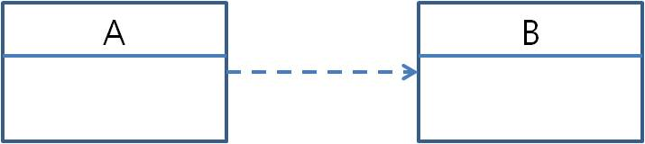
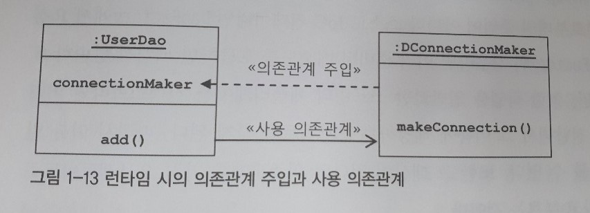

# 1-7 의존성 주입 (Dependency Injection)
   
IoC (제어의 역전)
 : 객체지향적인 설계, 디자인 패턴, 컨테이너에서 동작하는 서버 기술 사용
 
IoC 컨테이너
 : 객체를 생성하고 관계를 맺어주는 등의 작업을 담당하는 기능을 일반화한 것
  > IoC의 개념이 너무 폭넓게 사용되서 스프링이 제공하는 기능의 특징을 명확하게 설명하지 못함
     
\*  스프링이 제공하는 IoC방식의 핵심 -> __의존관계 주입(Dependency Injection)__ 
    

## 1. 의존 관계(Dependency relationship)란?
 : '누가 누구에게 의존하는 관계에 있다.' 라는 의미



__A가 B에 의존하고 있음__

### __- 특징__ 
- __의존한다는 것은 의존대상(B)이 변하면 그것이 A에 영향을 미친다는 뜻__
       B의 기능이 추가/변경, 형식이 바뀌면 그 영향이 A로 전달됨 

>EX)  A에서 B에 정의된 메소드를 호출해서 사용할 때 __-> 사용에 대한 의존관계__

- __의존관계에는 방향성이 있다.__
	A가 B에 의존하고 있지만, __B는 A에 의존하지 않는다 - 변화에 영향을 받지 않는다__


### - 종류
1. __설계모델 의존관계__ 

 2. __런타임 의존관계__


#### 1. 설계모델 의존관계

인터페이스에 대해서만 의존관계를 만들어두면 인터페이스 구현 클래스와의 관계는 느슨해지면서
변화에 영향을 덜 받는 상태가 됨 -> 결합도가 낮아짐
\* 인터페이스를 통해 의존관계를 제한해주면 그만큼 변경에서 자유로워짐

__위 UML에서 말하는 의존관계란 설계 모델의 관점임__

#### 2. 런타임 의존관계

런타임 시에 오브젝트 사이에서 만들어지는 의존관계도 있다 - 런타임 의존관계
설계 시점의 의존관계가 실체화된 것

```java
public UserDao()
{
	connectionMaker = new DConnectionMaker();
}
```
위 코드는 이미 설계시점에서 구체적인 클래스의 존재를 알고 있다. 
-> 모델링 때의 의존관계, 인터페이스의 관계 뿐만 아니라 런타임 의존관계까지 결정하고 관리하고 있다.

__위 코드의 문제점__
이미 런타임 시의 의존관계가 코드 속에 다 미리 결정되어 있다는 점

__해결방법__
IoC방식을 사용해서 UserDao로부터 런타임 의존관계를 드러내는 코드를 제거, 제 3의 존재에 런타임 의존관계 결정 권한을 위임한다

 \* 인터페이스를 통해 설계 시점에 느슨한 의존관계를 갖는 경우, 
    런타임 시 사용할 오브젝트가 어떤  클래스로 만든 것이지 미리 알 수가 없음. 
    -> 설계와 코드 속에서는 드러나지 않는다는 의미


## 2. 의존 관계 주입 (Dependency Injection)
: 오브젝트 레퍼런스를 외부로부터 제공받고 이를 통해 다른 오브젝트와 의존관계가 만들어지는 것이 핵심

자신이 사용할 오브젝트에 대한 선택과 생성 제어권을 외부로 넘기고 자신은 수동적으로 주입받은 오브젝트를 사용한다는 점에서 IoC의 개념에 잘맞음.
```java
public class UserDao
{
	private ConnectionMaker connectionMaker;
	public UserDao(ConnectionMaker connectionMaker)
	{
		this.connectionMaker = connectionMaker;
	}
}
```
DI 컨테이너에 의해 런타임 시에 의존 오브젝트를 사용할 수 있도록 그 레퍼런스를 전달받는 과정이
마치 메소드를 통해 주입해주는 것과 같다고해서 __'의존관계 주입'__ 이라 부름



#### 의존 관계 주입 조건 3가지
1. 클래스 모델이나 코드에는 런타임 시점의 의존관계가 드러나지 않는다.
	-> 인터페이스에만 의존하고 있어야함

2. 런타임 시점의 의존관계는 컨테이너나 팩토리 같은 제3의 존재가 결정한다.
> ##### \* 제3의 존재 : 스프링 애플리케이션 컨텍스트, 빈 팩토리, IoC컨테이너 등 

3. 의존관계는 사용할 오브젝트에 대한 레퍼런스를 외부에서 제공(주입)해줌으로써 만들어짐 


##  3. 의존 관계 검색 (Dependency Lookup)

외부로부터의 주입이 아니라 스스로 검색을 이용하는 IoC방법도 제공함.

자신이 어떤 클래스의 오브젝트를 이용할지 결정하지 않음 -> IoC 의미 

런타임 시 의존관계를 맺을 오브젝트를 결정하는 것과 오브젝트의 생성작업은 외부 컨테이너에게 IoC로 맡기지만,
이를 가져올 때는 메소드나 생성자를 통한 주입 대신 __스스로 컨테이너에게 요청하는 방법 사용__

```java
public UserDao()
{
	DaoFactory daoFactory = new DaoFactory();
	this.connectionMaker = daoFactory.connectionMaker();
}
```
미리 준비된 메소드를 호출하면 되므로, 단순히 요청으로 보이지겠지만, 
일반화한 스프링의 애플리케이션 컨텍스트라면, 미리 정해놓은 이름을 전달해서 그 이름에 해당하는 오브젝트를 찾게됨
```java
public UserDao()
{
	AnnotationConfigApplicationContext context = new AnnotationConfigApplicationContext(DaoFactory.class);
	this.connectionMaker = context.getBean("connectionMaker", ConnectionMaker.class);
}
```

\*  방법만 조금 다를 뿐, 의존관계 주입의 거의 모든 장점을 갖고 있고, IoC 원칙에도 잘 맞음. 


## 의존 관계 주입 (DI) , 의존 관계 검색 (DL) 차이점

#### 의존관계 검색 방식 (DL)
1. 오브젝트 팩토리클래스, 스프링API로 컴포넌트와 연결할때 사용
     (성격이 다른 오브젝트에 의존하는 것을 막음)
    애플리케이션의 기동 시점에 적어도 한 번은 의존관계 검색 방식을 사용해 오브젝트를 가져와야함.
    
2. 검색하는 오브젝트는 자신이 __스프링의 Bean일 필요가 없다__
getBean()을 사용한 의존관계 검색일 경우, 직접 new로 만들어서 사용해도 됨.
단, 사용하는 인터페이스만 스프링의 Bean으로 등록 하면됨.

#### 의존관계 주입 방식 (DI)
 1. 의존관계 검색 방식보다 훨씬 단순하고 깔끔하다.
 
 2. 사용자에 대한 DB정보를 가져오는 Dao같은 경우에 사용하기 적당함
 
 3. 컨테이너가 해당 Dao안에 인터페이스 오브젝트를 주입해주려면, 
 해당 Dao에 대한 생성과 초기화 권한을 갖고 있어야 하기 때문에, __Bean으로 등록되어 있어야함.__


## 의존관계 주입의 응용

### 결론 
의존관계 주입의 장점
: 코드에는 런타임 클래스에 대한 의존관계가 나타나지 않고, 인터페이스를 통해 결합도가 낮은 코드를 만들므로, 다른 책임을 가진 사용 __의존관계에 있는 대상이 바뀌거나 변경되더라도 자신은 영향을 받지 않으며, 변경을 통한 다양한 확장 방법에는 자유롭다__
(스프링에서 제공하는 기능의 99%가 DI 사용) 


 > #### \* OCP (개방폐쇄의 원칙 Open Close Principle)  :  확장에는 열려있고 변경에는 닫혀있어야 한다는 원리

 


## 메소드를 이용한 의존관계 주입
의존주입은 생성자가 아닌 일반 메소드를 사용할 수 도 있다. (생성자보다 더 자주 사용됨)
2가지방법
1. 수정자(Setter) 메소드를 이용한 주입
     : 외부에서 오브젝트 내부의 애트리뷰트 값을 변경하려는 용도로 주로 사용됨
        메소드는 항상 set으로 시작함. 수정자라고 불리기도 함
        
        수정자(Setter) 메소드의 핵심기능은 파라미터로 전달된 값을 보통 내부의 인스턴스 변수로 저장하는 것
         부가적으로, 입력 값에 대한 검증, 그 밖의 작업 수행할 수 있음
         외부로 부터 제공받은 오브젝트 레퍼런스를 저장해뒀다가 내부의 메소드를 사용하게 하는 
         DI방식에 활용하기 적당함

```java
public class UserDao
{
	private ConnectionMaker connectionMaker;
	
	public void setConnectionMaker(ConnectionMaker connectionMaker)
	{
		this.connectionMaker = connectionMaker;
	}
}
```
2. 일반 메소드를 이용한 주입
    : 여러 개의 파라미터를 갖는 일반 메소드 
	     \* 생성자가 수정자 메소드보다 나은 점 -> 한번에 여러 개의 파라미터를 받을 수 있다
             
         생성자의 단점 
         :  파라미터의 개수가 많아지고 비슷한 타입이 여러개일 때 한 번에 모든 필요한 파라미터를 다 받아야 하는 생성자보다 나음. 
             